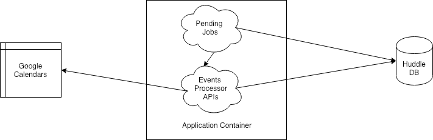

# Calendar Events Processor

## Table of Contents

   * **[Description](#description)**
   * **[Architecture](#architecture)**
     * [Google Calendars](#google-calendars)
     * [Huddle DB](#huddle-db)
     * [Pending Jobs](#pending-jobs)
     * [Event Processor APIs](#event-processor-apis)
   * **[Connect To Huddle DB For Analytics](#connect-to-huddle-db-for-analytics)**

## Description
Calendar Events Processor is an ETL service which takes data in Google Calendar as source of truth and stores it in MySql Database.
This service is hosted on Google Cloud using App Engine as the Application Platform and Cloud SQL as database.

## Architecture

#### Google Calendars
This service uses all Google calendars part of a centralized Huddle Google Account as source of truth

#### Huddle DB
CloudSQL hosted on Google Cloud is used as the database source. The fundamental tables part of it are

1) **Location**: This stores metadata information of all the different geographic location of Huddle Sports Facility, along with Google Calendar ID    
2) **Events**: This stores information of all the individual calendar events    
2) **Pending Jobs**: This stores metadata information of all Pending Jobs.

#### Pending Jobs
These are cron jobs with metadata information present in Pending Jobs database table, which describes schedule and status of this job. Schedule has information about start and end dates for bootstrapping data from Google Calendar. If end date is absent it means this job will go on forever. Once data is bootstrapped till the end data, the job is marked as completed. This jobs can also be defined against specific location table.

#### Event Processor APIs
1) `/sync/calendars`: This looks at the all the calendars present for the centralized Google Account and creates necessary Location metadata records.

2) `/process/events`: This syncs Google calendar events in database for specific start/end date and location. Pending Jobs cron jobs calls this API.

## Connect To Huddle DB For Analytics

- [Install MySQL Proxy](https://cloud.google.com/sql/docs/mysql/connect-admin-proxy#install)
- Start proxy by executing following command in terminal.

    `./cloud_sql_proxy -instances=huddle-quick-solutions:us-central1:huddle-events-processor=tcp:330`
- Install your preferred MySQL client. Following are the connection details

    `mysql -u data-analytics -p --host 127.0.0.1 Huddle` 
     